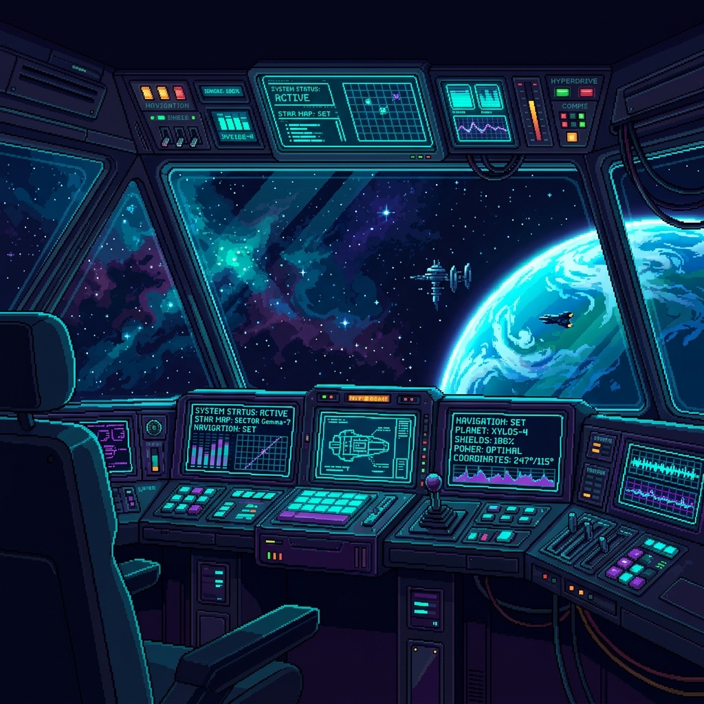

<p align="center">
  
</p>

```text
+--------------------------------------------------------------------------------------------+
|                                                                                            |
|         __   __ _  ___   ___   ___    ___    ___      _    _  _ __      __ _  _ _          |
|        \ \ / // _` | \ / / \ / _ \  / _ \  / _ \    /_\  | \| |\ \    / // _` | '_|        |
|         \ V /| (_| |  V  /| | (_) || (_) || (_) |  / _ \ | .` | \ \/\/ /| (_| |  |         |
|          |_|  \__,_|  |_| |_|\___/  \______\___/_/_/   \_\|_|\_|  \_/\_/  \__,_|_|         |
|                                                                                            |
|     ============================== SYSTEMS OPERATION ================================      |
|   • Status: Active (4+ YOE Software Architect / AI Engineer)                               |
|   • Location: Karachi, PK (Remote Operations Worldwide)                                    |
|   • Current Coordinates: Software Engineer II @ Data Science Dojo                          |
|                                                                                            |
+--------------------------------------------------------------------------------------------+

+-- [ SKILLS & CARGO LOADOUT ] --------------------------------------------------------------+
|                                                                                            |
|   [Languages]    TypeScript  •  JavaScript  •  Python  •  SQL  •  Go (Basic)               |
|   [Frameworks]   React.js  •  Next.js (App Router)  •  React Native  •  Nest.js            |
|   [Engines/AI]   LLM Chat Engines  •  FastAPI  •  Llama2 (Real-Time Inference)             |
|   [Tools/Arch]   Docker  •  Git  •  Shell Scripting  •  Linux Terminal  •  CI/CD           |
|                                                                                            |
+--------------------------------------------------------------------------------------------+

+-- [ FLIGHT LOG: MISSION CHRONICLES ] ------------------------------------------------------+
|                                                                                            |
|   🚀 MISSION 02: Software Engineer II | Data Science Dojo                                   |
|      [ Remote, US ]                                                [ Dec 2024 - Present ]  |
|      • Engineered core LLM chat engines, Markdown rendering, and text-to-speech            |
|        streaming setups for Ejento.ai.                                                     |
|      • Built automated messaging adapters across Slack, Discord, and MS Teams.             |
|      • Designed interactive dashboards to track user activity & API metrics.               |
|      • Collaborated to integrate embeddable AI agents and advanced document tools.         |
|                                                                                            |
|   🚀 MISSION 01: Full Stack & React Native Developer | Tezaract.ai                          |
|      [ Karachi, PK ]                                               [ Oct 2022 - Nov 2024 ] |
|      • Built and deployed cross-platform React Native & Next.js applications.              |
|      • Designed and shipped robust backend REST APIs and microservices (Nest/Node).        |
|      • Managed multi-tier storage layers (SQL/NoSQL) for contextual chatbot agents.        |
|      • Automated App Store & Google Play provisioning and package releases.                |
|                                                                                            |
+--------------------------------------------------------------------------------------------+

+-- [ SYSTEMS HANGAR: PROJECTS ] ------------------------------------------------------------+
|                                                                                            |
|   🛰️ HEADLESS CURATOR (Automated Content Curation Pipeline)                                |
|      [ Stack: Python, Next.js, Docker ]                                                    |
|      • Automated worker layers programmatically generating high-aesthetic layout content.  |
|      • Managed dockerized worker execution via centralized Next.js orchestrator.           |
|                                                                                            |
|   🛸 LLAMA2 LLM HACKATHON INTERFACE                                                         |
|      [ Stack: Python, FastAPI, Llama2 ]                                                    |
|      • Developed custom domain-specific AI interface using open-source models.             |
|      • Designed clean, low-latency endpoints for real-time inference.                      |
|                                                                                            |
+--------------------------------------------------------------------------------------------+

+-- [ STAR CREDENTIALS ] --------------------------------------------------------------------+
|                                                                                            |
|   • Google UX Design Professional Certificate                                              |
|   • Microsoft Certified: Azure Fundamentals (AZ-900)                                       |
|                                                                                            |
+--------------------------------------------------------------------------------------------+

+-- [ STARLINK PORTAL ] ---------------------------------------------------------------------+
|                                                                                            |
|   ✉️ Email:      yarooq1@gmail.com                                                         |
|   🔗 LinkedIn:   linkedin.com/in/YarooqAnwar                                                |
|   🐙 GitHub:     github.com/YarooqH                                                         |
|                                                                                            |
+--------------------------------------------------------------------------------------------+
```

<p align="center">
  <a href="https://github.com/YarooqH">
    
  </a>
  <a href="https://github.com/YarooqH">
    
  </a>
</p>
